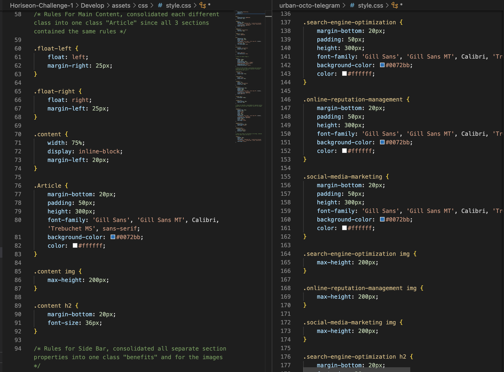
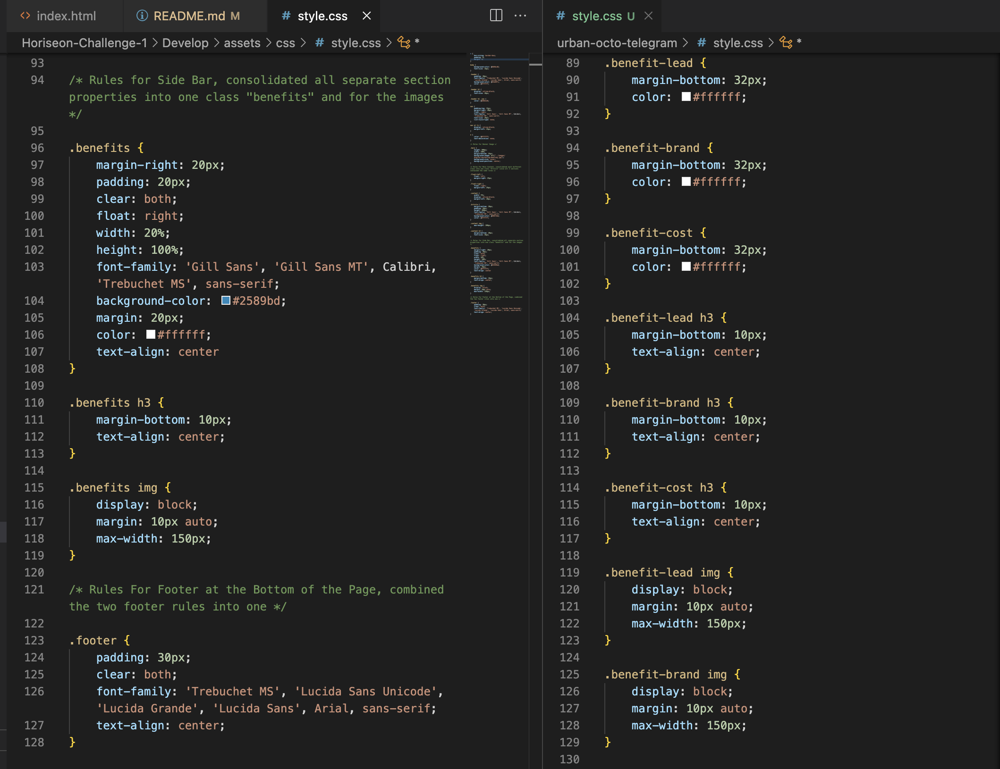

# Code Refactor Starter Code

## Description

This was a refactor code job for Horiseon. I had to improve the code by consolidating CSS selectors and properties, and restructuring it without changing the webpage layout itself. Organzation was key as I added clarity to the code by adding HTML semantic elements. I also had to add alt attributes so it can make the website more accessible so those with disabilities can access the page with no problem.

By doing this job for Horiseon, it helped hone my HTML and CSS coding skills.

## Installation

N/A

## Usage

The screenshots below show my updated CSS on the left side compared to the original code Horiseon provided me with on the right side. You can see the unneccesary repititon of code on the right compared to the cleaned up code on the left.

How I Consolidated the Main Content

How I consoldiated the Side Bar Content

Link to Website is below
https://rosebudroro.github.io/Horiseon-Challenge-1/

## Credits

N/A

